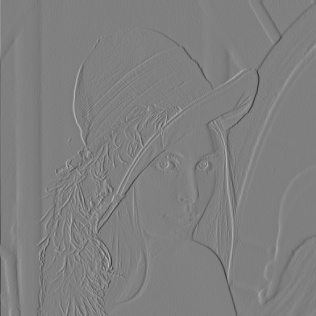

#  DPCM编码
## 1.运行方式
    将处理图片放在Source文件里面
    在终端输入以下命令：
    $ python .\DPCM.py image_path bit
    iamge_path为图片放置位置，bit为量化比特

##  2.结果
### 2.1PSNR和SSIN
| bit  | PSNR  | SSIM  |
| :--: | :---: | :---: |
|  8   | 51.13 | 0.998 |
|  4   | 23.12 | 0.794 |
|  2   | 9.17  | 0.277 |
|  1   | 8.81  | 0.365 |
### 2.2图像结果
   

     8-bit  &nbsp; &nbsp;
    
    
    

 

     4-bit  &nbsp; &nbsp;
    
    
    

 

     2-bit  &nbsp; &nbsp;
    
    
    

 

     1-bit  &nbsp; &nbsp;
    
    
    

